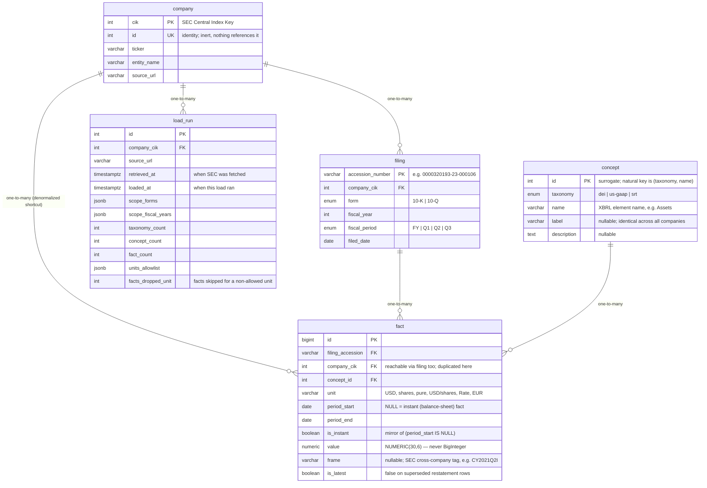

# `app/db` — XBRL schema map

A rendered picture of the five tables in the `xbrl` PostgreSQL schema and how they
connect, focused on the XBRL data. This is the *reference* companion to
[`DESIGN.md`](DESIGN.md) (the rationale) and [`models.py`](models.py) (the source
of truth). If any of the three disagree, `models.py` wins.

Only `company` / `filing` / `concept` / `fact` correspond to the SEC
`xbrl/companyfacts` payload. `load_run` is this project's own bookkeeping — see
[§ load_run](#load_run) below.

---

## The diagram



Every relationship is **one-to-many** (`||--o{`) — a primary key on the "one" side,
the foreign-key column that references it on the "many" side (crow's foot). There
are no one-to-one relationships. The `ON DELETE` rule for each FK is listed in
[How the tables connect](#how-the-tables-connect) below, not on the arrows.

Plain-text form (from `DESIGN.md` § 2):

```
company ─1:∞─ filing ─1:∞─ fact ─∞:1─ concept
   │                        │
   └─1:∞─ fact   (denormalized shortcut past filing)
   └─1:∞─ load_run
```

---

## How the tables connect

`fact` is the centre of gravity — one row per reported number. Every other table
exists to give a fact its meaning or to record how it was loaded.

| From `fact` | → | Cardinality | Meaning | `ON DELETE` |
|---|---|---|---|---|
| `concept_id` | `concept.id` | many-to-one | *what* is measured (`us-gaap / Assets`) | `RESTRICT` |
| `filing_accession` | `filing.accession_number` | many-to-one | *which* 10-K / 10-Q reported it | `CASCADE` |
| `company_cik` | `company.cik` | many-to-one | *whose* number it is | `CASCADE` |

The rest:

- `company` → `filing` (1:∞) — a company files many 10-Ks and 10-Qs.
- `company` → `fact` (1:∞) — the **denormalized shortcut**. `company` is already
  reachable through `filing`; the FK is duplicated straight onto `fact` because
  nearly every query slices by company, and the partial index
  `ix_fact_latest_lookup` needs the column local. Costs 4 bytes/row.
- `company` → `load_run` (1:∞) — one row per *load*, and a company is loaded more
  than once over time (fresher file, wider unit allow-list, retry). "One row per
  load" and "many rows per company" are both true.
- `concept` is **global reference data** — one row per `(taxonomy, name)`, shared
  by all companies. `label` / `description` are byte-identical everywhere, so they
  live here once, not per company. The FK from `fact` is `RESTRICT`: a concept
  can't be deleted while any fact points at it.

---

## Reading one fact

1. **The row.** A `fact` says `value = 352583000000`, `period_end = 2023-09-30`,
   `unit = USD`, `is_instant = true` (no `period_start` → a balance-sheet figure).
2. **→ concept.** `concept_id` resolves to `us-gaap / Assets`. Label and
   description are read from there, never repeated on the fact.
3. **→ filing.** `filing_accession` resolves to the 10-K that reported it:
   `form 10-K`, `fiscal_year 2023`, `filed_date 2023-11-03`. Those four repeated
   fields are hoisted onto `filing` so `fact` doesn't carry them.
4. **→ company.** `company_cik` points straight at `company` (Apple, CIK 320193)
   without going through `filing` — the denormalized shortcut.
5. **Restatement.** If Apple later refiles that period with a different number,
   the new row is inserted and the old one is kept but flipped to
   `is_latest = false`. Analytical queries filter `WHERE is_latest`.

---

## `load_run`

Not SEC data — this project's own bookkeeping, touched only by `company`. One row
per run of the load step (`data/xbrl/<TICKER>.json` → rows in these tables),
recording:

- `source_url`, `retrieved_at` (when retrieval fetched the file from SEC) vs
  `loaded_at` (when this load ran)
- the `scope` block that was pulled (`scope_forms`, `scope_fiscal_years`)
- the `counts` block (`taxonomy_count` / `concept_count` / `fact_count`) — a
  checksum for the load
- `units_allowlist` and `facts_dropped_unit` — how many facts were dropped for
  having an XBRL unit outside the allow-list
  (`USD, shares, pure, USD/shares, Rate, EUR`). Those tag disclosure counts
  (lawsuits, warehouses, segments), not financial-statement data.

> The load step (`app/db/loader.py`) is **not written yet** — `load_run` is a
> defined table with no code populating it. See `DESIGN.md` § 5.

---

## Enum types

Native PostgreSQL enums, in the `xbrl` schema alongside the tables:

| type | values |
|---|---|
| `taxonomy` | `dei` · `us-gaap` · `srt` |
| `filing_form` | `10-K` · `10-Q` |
| `fiscal_period` | `FY` · `Q1` · `Q2` · `Q3` |

The whole namespace drops with one `DROP SCHEMA xbrl CASCADE` for a clean reload.

---

Row counts throughout are the measured corpus: 20 companies, 10-K / 10-Q filings,
five fiscal years (`DESIGN.md` § 7).
